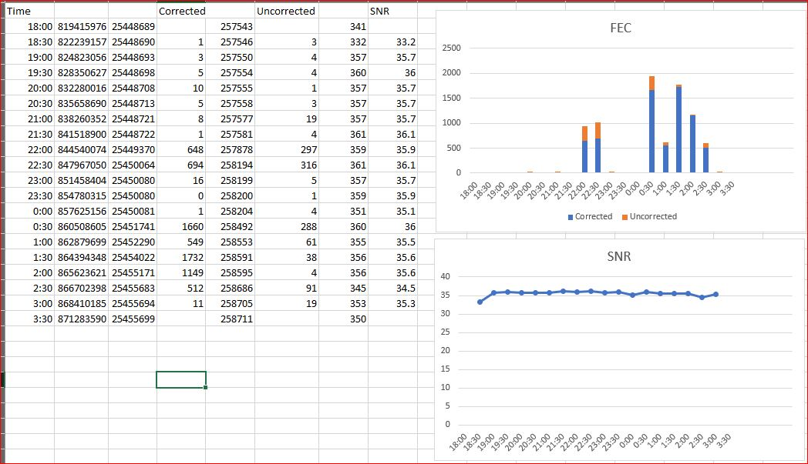

# Fetches SNR & FEC data via SNMP


This script fetches the following OIDs:

docsIfSigQUnerroreds	.1.3.6.1.2.1.10.127.1.1.4.1.2
	Codewords received on this channel without error.
 	This includes all codewords, whether or not they
 	were part of frames destined for this device.

docsIfSigQCorrecteds	.1.3.6.1.2.1.10.127.1.1.4.1.3
	Codewords received on this channel with correctable
 	errors. This includes all codewords, whether or not
 	they were part of frames destined for this device.

docsIfSigQUncorrectables  	.1.3.6.1.2.1.10.127.1.1.4.1.4
	Codewords received on this channel with uncorrectable
 	errors. This includes all codewords, whether or not
 	they were part of frames destined for this device.

docsIfSigQSignalNoise	.1.3.6.1.2.1.10.127.1.1.4.1.5
	Signal/Noise ratio as perceived for this channel.
 	At the CM, describes the Signal/Noise of the downstream
 	channel.  At the CMTS, describes the average Signal/Noise
 	of the upstream channel.

How to use it:

./snmp.sh

Use `#show snmp mib ifmib ifindex` in the CBR8 in order to obtain the indexes of the interfaces.

The result will be a txt file named with the ifindex with the contents:
```
[Time (HH:MM)],[Nb of cw without error],[Nb of cw corrected],[Nb of cw uncorrected],[SNR]
```

Example: 488091.txt:

```
18:22,149994,0,448,421
18:22,149995,0,448,421
18:22,149996,0,448,421
18:23,149996,0,448,421
```
The file `fec_snr.bas` can be imported to Excel in order to facilitate producing the charts:

1) From Excel main menu go to Developer
2) Click the option "Visual Basic"
3) From the Visual Basic menu go to File > Import File and select `fec_snr.bas`
4) Two macros will be available:
   - Open_txt_SNRFEC (which opens the text files generated by the script)
   - Generates_SNRFEC_graphs (which generates the charts for FEC and SNR for each upstream channel)
5) The end result is as follows:




   